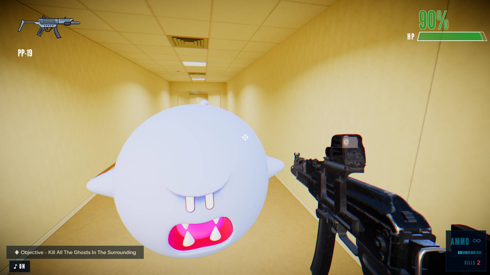
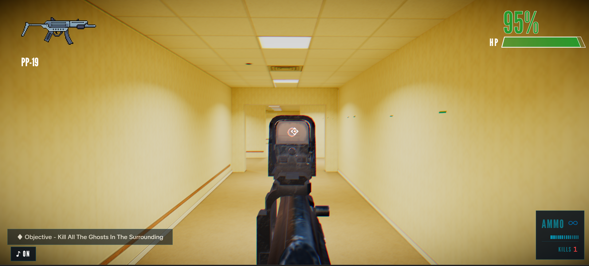
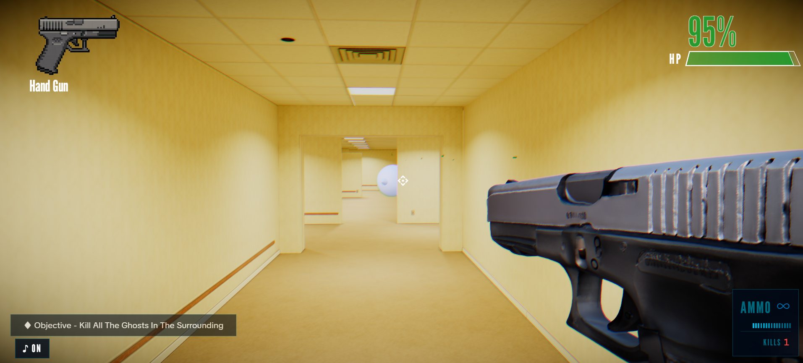
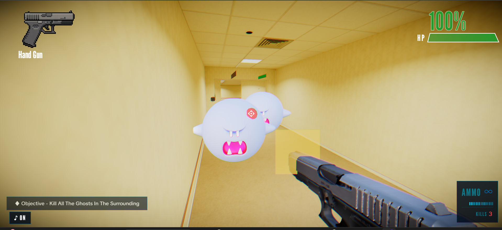
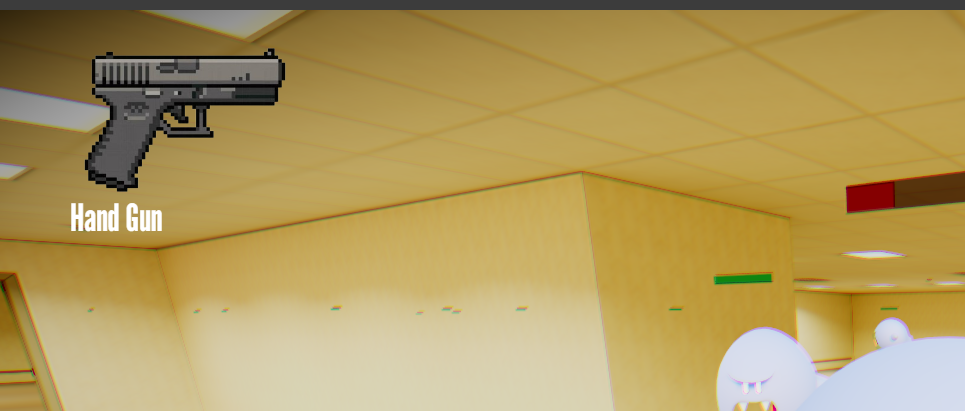
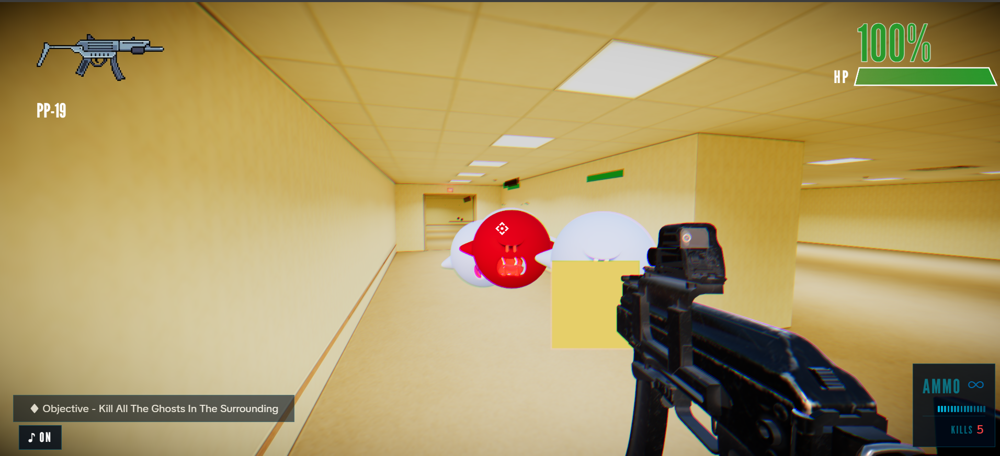
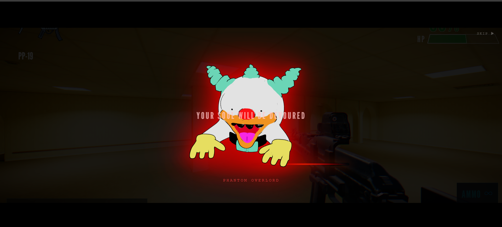

# fps-game — WebGL FPS demo (React + Vite)

A first-person shooter demo built with React, Vite, React Three Fiber, @react-three/rapier physics, and Zustand state management. The game mixes fast-paced combat, cinematic boss encounters, and a stylized HUD with a dramatic zoom-in effect that makes every shot feel more intense.

## Play the game

[▶ Play Now](https://gungale-qik2.vercel.app/)


## Demo Video

If you add a demo video file to `public/demo.mp4`, it will be visible here in supported Markdown renderers.

<video src="/demos/demo.mp4" controls width="720">
  Your browser does not support the video tag.
</video>

## Screenshots




## Zoom in scope





## Ghost Enemy



## Gun switch UI





## Boss Fight



[Game screenshot](/demos/8.png)

### Boss encounter highlights
- A cinematic boss cutscene introduces the Phantom Overlord before the fight begins.
- The boss has a visible health bar and enraged state as its health drops.
- Defeating the boss triggers a victory screen and a strong sense of progression.

### Zoom-in effect
When the player gets hit or enters a high-intensity moment, the game uses a sharp visual zoom and impact feedback to make the action feel more dramatic and immersive.

> Add more screenshots to the project and link them here for a richer gallery.

## Getting started

Prerequisites: Node.js (16+) and npm.

Install dependencies and run the development server:

```bash
npm install
npm run dev
```

Open the URL shown by Vite (usually http://localhost:5173) in a WebGL-capable browser.

Build for production:

```bash
npm run build
npm run preview
```

## Controls

- Click the canvas to capture the mouse (pointer lock)
- Move: `W`, `A`, `S`, `D`
- Jump: `Space`
- Release mouse: `Esc`
- Shoot: left mouse button
- Switch weapons: mouse wheel

## Features

- Physics-driven first-person movement with a Rapier capsule collider
- Pointer lock controls via `@react-three/drei`
- Multiple weapons with view models, recoil, and firing sound effects
- Enemy ghosts with wandering AI, health bars, and kill counting
- Boss fight system with a cinematic intro, health bar, enraged phase, and defeat screen
- Dramatic zoom-in and hit feedback to emphasize danger and impact
- Post-processing: SSAO, chromatic aberration, vignetting, and tone mapping
- HUD showing ammo, kills, weapon name, objective, and hit feedback
- Static world loaded from a GLB environment model with trimesh collision

## Project structure

- `index.html` — application shell
- `src/main.jsx` — React entry point
- `src/App.jsx` — top-level app container for HUD and game canvas
- `src/components/GameCanvas.jsx` — ThreeFiber canvas, lighting, environment, postprocessing, and physics provider
- `src/components/Player.jsx` — player movement, jumping, firing, pointer lock, and camera sync
- `src/components/World.jsx` — loads `/models/backrooms.glb` and converts it to a fixed collision body
- `src/components/GunViewModel.jsx` — first-person weapon models and firing animation
- `src/components/EnemyTarget.jsx` — enemy AI, damage handling, and death behavior
- `src/components/HUD.jsx` — on-screen ammo, kills, objective, and crosshair overlay
- `src/store/UserStore.js` — Zustand game state for ammo, health, kills, weapon selection, and hit feedback

## Asset notes

- World model: `public/models/backrooms.glb`
- Enemy model: `public/models/ghost.glb`
- Weapon models: `public/models/gun.glb`, `public/models/handgun.glb`, `public/models/ak-742.glb`
- Sounds and textures are stored under `public/sounds` and `public/images`

## Troubleshooting

- If the scene remains black, ensure your browser supports WebGL and hardware acceleration.
- If models or sounds fail to load, check that static assets exist in `public/models` and `public/sounds`.
- If pointer lock is not engaging, click the canvas and allow browser permission prompts.

## License & credits

This repository is a demo project. Check individual assets in `public/models`, `public/sounds`, and `public/images` for any separate license terms.
